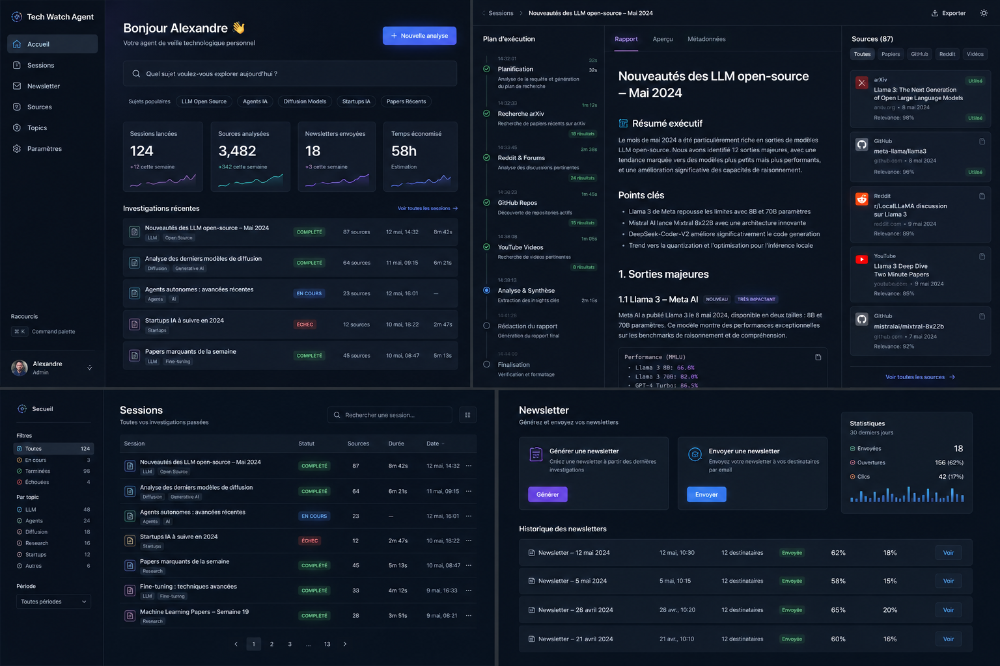
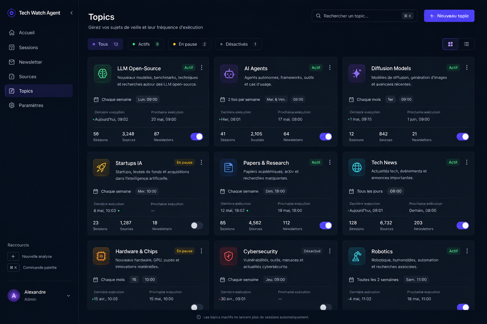
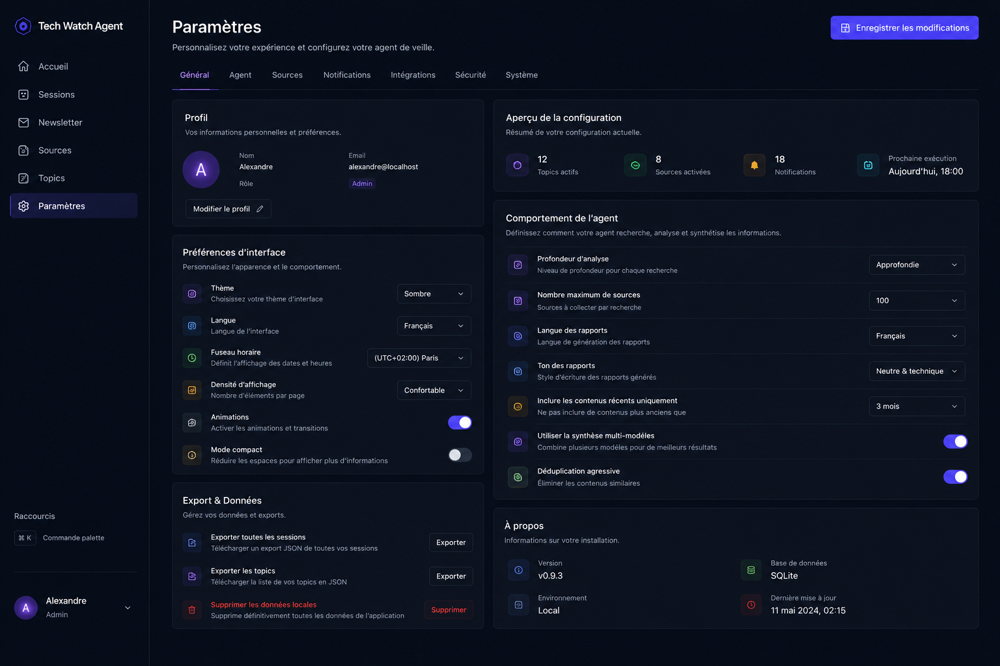

# Tech Watch Agent — UX / Product Brief

## Vision

Tech Watch Agent doit être un **cockpit personnel de veille technologique programmée**.
Le produit ne sert pas seulement à lancer une recherche ponctuelle. Il sert surtout à:

- programmer plusieurs veilles récurrentes
- choisir leur cadence d'exécution
- suivre leur état en direct
- lire un rapport structuré produit par l'agent
- retrouver l'historique, les sources, les échecs et les résultats

Le produit doit se situer entre:

- un dashboard premium type Linear / Vercel
- un workspace d'analyse type Perplexity / Arc
- une console d'exécution d'agents avec timeline, streaming et sources

Ce n'est pas une landing page.
Ce n'est pas un CRUD admin classique.
Ce n'est pas une simple liste de rapports.

## Références visuelles

### Vue générale

Cette image fixe la direction globale:

- sidebar fixe
- dark theme premium
- panneaux denses mais lisibles
- hiérarchie claire entre cockpit, sessions, newsletter et détails

### Accueil

### Sessions

### Session en cours

### Topics

### Newsletter

### Paramètres

## Ce que l'expérience doit faire ressentir

Quand j'ouvre l'application, je dois sentir que:

- mes veilles sont organisées
- elles tournent vraiment toutes seules selon une cadence définie
- je vois immédiatement ce qui est en cours, programmé, terminé ou cassé
- chaque session produit un rapport utile et consultable
- le suivi en temps réel est crédible, lisible et agréable à regarder

L'expérience doit être plus proche d'un **workspace vivant d'agents** que d'un écran de backoffice.

## Modèle produit à respecter

### 1. Une session sur la page Sessions = une veille programmée

La page Sessions ne doit pas être une table brute d'exécutions historiques.
La vue principale doit être une **grille de cards**.

Chaque card représente une veille programmée:

- sujet ou nom de la veille
- description courte
- cadence
- prochain run
- dernier run
- statut global
- métriques utiles
- accès direct au détail

Exemples de cadence:

- une fois par semaine
- deux fois par semaine
- tous les jours ouvrés
- une fois par mois

Statuts visibles en priorité:

- `En cours`
- `Programmée`
- `Terminée`
- `Échouée`
- éventuellement `En pause`

### 2. Le détail d'une session = le workspace d'exécution

Quand on clique sur une card, on ouvre la page de détail de cette session.
Cette page doit devenir le coeur du produit.

Structure cible:

- colonne gauche: plan d'exécution / timeline
- colonne centrale: rapport de l'agent
- colonne droite: sources, filtres et métadonnées

Cette structure correspond directement à `img/Session_en_cours.png`.

### 3. Le streaming doit être une fonction centrale

Si une session est en cours, l'interface doit montrer en direct:

- l'étape active
- la progression globale
- l'apparition progressive des sources
- le markdown du rapport qui se construit au fil de l'eau

Le rapport ne doit pas attendre la fin complète pour devenir visible.
On veut un rendu streamé propre, stable et lisible.

## Architecture UX cible par page

### Accueil

Référence: `img/Accueil.png`

L'accueil reste un cockpit.
Il doit permettre de:

- lancer une nouvelle analyse
- voir les sessions récemment exécutées
- voir la valeur produite
- accéder vite à une session active

Blocs attendus:

- hero compact avec recherche ou création
- chips de sujets fréquents
- cartes de stats
- liste d'investigations récentes
- raccourcis vers sessions, topics et newsletter

### Sessions

Référence: `img/Sessions.png`

La page Sessions doit être une **galerie de cards programmées**, pas une table principale.

Chaque card doit montrer au minimum:

- titre
- badge de statut
- fréquence d'exécution
- prochain déclenchement
- dernière exécution
- nombre de runs
- nombre moyen de sources ou de rapports
- éventuellement la santé de la veille

Actions attendues:

- ouvrir le détail
- lancer manuellement
- mettre en pause
- éditer la programmation
- dupliquer

Filtres attendus:

- Toutes
- En cours
- Programmées
- Terminées
- Échouées
- recherche texte
- filtre par topic / source / période

### Détail d'une session

Référence: `img/Session_en_cours.png`

C'est la page la plus importante du produit.

#### Colonne gauche

Elle montre la timeline d'exécution:

- plan prévu
- étape courante
- durée de chaque étape
- nombre de résultats collectés
- état done / running / failed
- possibilité future de reprise sur checkpoint

#### Colonne centrale

Elle montre le rapport, avec des tabs comme:

- `Rapport`
- `Aperçu`
- `Métadonnées`

Le rendu markdown doit être premium:

- excellente typographie
- bon rythme vertical
- tableaux lisibles
- citations et callouts visibles
- code blocks propres
- titres hiérarchisés
- ancres ou mini-sommaire si besoin

Quand la session est en cours, le centre doit supporter un vrai rendu live:

- apparition progressive des sections
- curseur ou indicateur d'écriture discret
- scroll intelligent
- pas de reflow agressif
- stabilité visuelle pendant le streaming

#### Colonne droite

Elle montre les sources:

- filtres par type
- cartes de source
- score ou pertinence
- domaine
- date
- statut utilisée / ignorée / faible pertinence
- accès rapide au lien

Pendant l'exécution, cette colonne doit aussi se mettre à jour progressivement.

### Topics

Référence: `img/Topics.png`

La page Topics sert à gérer les axes de veille ou profils thématiques.
Elle peut aussi être pensée comme la couche de configuration des sujets récurrents.

Elle doit permettre de:

- voir quels topics sont actifs
- voir leur cadence
- voir leur dernière exécution
- voir leur prochaine exécution
- activer / désactiver rapidement

Le style reste card-based, cohérent avec Sessions.

### Newsletter

Référence: `img/Newsletter.png`

La newsletter fait partie du même système.
Elle ne doit pas ressembler à une page secondaire bâclée.

Blocs attendus:

- génération
- envoi
- historique
- métriques simples
- aperçu de performance

Le lien logique doit être visible:

- les sessions nourrissent la newsletter
- la newsletter est une sortie éditoriale du moteur de veille

### Paramètres

Référence: `img/Paramètres.png`

La page paramètres doit être paneled et sérieuse.
Elle regroupe:

- réglages généraux
- préférences d'affichage
- scheduling
- providers / outils / intégrations
- email / newsletter
- éventuellement prompts et modèles

## Direction visuelle

### Style

La bonne direction est celle des captures:

- dark premium
- bleu nuit / ardoise
- surfaces superposées
- bordures fines
- glow subtil sur les actions importantes
- sensation produit technique haut de gamme

Je déconseille la palette actuelle "desert rose" du frontend existant.
Elle ne correspond pas aux références et éloigne le produit du rendu attendu.

### Typographie

La typographie doit être plus éditoriale que l'existant.

Recommandations:

- une sans expressive et propre pour l'UI
- une hiérarchie très nette pour titres, sous-titres, labels et méta
- un rendu markdown nettement plus travaillé que le HTML actuel

Le rapport central doit se lire comme un vrai document de recherche, pas comme un bloc HTML rendu par défaut.

### Composants importants

Les composants qui définissent la qualité perçue sont:

- cards de sessions
- badges de statut
- timeline de progression
- rendu markdown streamé
- cartes de sources
- tabs de détail
- filtres rapides
- panneaux statistiques

## Streaming et markdown

Le streaming du rapport est une exigence produit, pas un bonus.

Comportement attendu:

- le rapport commence à apparaître pendant l'exécution
- les nouvelles sections s'ajoutent proprement
- la mise en forme markdown reste belle même en flux partiel
- les sources associées apparaissent dans la colonne droite au bon moment
- la timeline reflète immédiatement le changement d'étape

Le rendu markdown doit gérer correctement:

- titres
- listes
- tableaux
- citations
- code blocks
- liens
- callouts

## Évaluation de la stack frontend actuelle

Le frontend actuel est basé sur:

- FastAPI + Jinja templates
- Tailwind via CDN
- Alpine.js
- HTMX

Cette stack peut suffire pour:

- un dashboard interne simple
- des formulaires
- des listes
- un peu d'interactivité serveur

Elle devient moins adaptée pour la cible montrée dans les images, surtout pour:

- une vraie grille riche de cards pilotées côté client
- une page session très interactive en 3 colonnes
- un streaming temps réel propre du rapport
- un rendu markdown sophistiqué et évolutif
- des états UI complexes et persistants
- des transitions et filtres fluides

## Recommandation

Je recommande de **garder FastAPI pour le backend** et de **repartir sur un frontend séparé en React + TypeScript + Vite**.

Pourquoi:

- meilleure modélisation de l'état UI
- meilleure gestion du streaming
- composants réutilisables pour cards, timeline, sources, markdown
- plus simple pour atteindre fidèlement les écrans cibles
- meilleure maintenabilité si le dashboard devient le coeur du produit

Je ne recommande pas un "full rewrite" backend.
Je recommande plutôt:

- backend actuel conservé pour API, orchestrateur, scheduler, persistance
- nouveau frontend SPA en `React + TypeScript + Vite`
- communication via API REST + streaming `SSE` ou `WebSocket`

## Direction technique recommandée

### Backend

Conserver:

- FastAPI
- orchestrateur actuel
- scheduler
- base de données
- services métier

Faire évoluer:

- endpoints API orientés frontend
- endpoint de détail de session
- endpoint de streaming live pour timeline + rapport + sources

### Frontend

Construire:

- app React + TypeScript
- routing frontend propre
- design system léger
- renderer markdown sérieux
- couche live pour sessions en cours

### Priorité de refonte

Ordre recommandé:

1. page `Sessions`
2. page `Détail session`
3. page `Accueil`
4. page `Topics`
5. page `Newsletter`
6. page `Paramètres`

## Conclusion

La direction cible est maintenant claire:

- `Sessions` = grille de veilles programmées
- `Session detail` = workspace d'exécution vivant
- le streaming markdown doit être une fonctionnalité centrale
- les captures de `docs/img` doivent servir de référence directe

La stack actuelle peut dépanner, mais elle n'est plus idéale pour viser ce niveau de produit.
Pour obtenir quelque chose de vraiment propre, cohérent et durable, la bonne décision est de passer sur **TypeScript + React + Vite** pour le frontend.

### Sidebar

Doit être:

- stable
- discrète
- immédiatement scannable

Inclure:

- logo / nom produit
- navigation principale
- raccourcis utiles
- profil utilisateur

### Carte de session

Élément central du produit.
Elle doit résumer:

- sujet
- statut
- tags
- nombre de sources
- date
- durée

### Badge de statut

Les badges doivent être lisibles sans bruit.
Ils doivent distinguer clairement:

- en cours
- terminé
- échoué
- suspendu / reprise possible

### Timeline d'exécution

Elle doit être plus qu'une simple liste:

- progression réelle
- état actuel mis en évidence
- durée par étape
- feedback visuel sur les résultats produits

### Carte source

Chaque source doit exposer vite:

- origine
- titre
- type
- score de pertinence
- date
- lien

### Rapport

Le rapport doit ressembler à un document de travail de qualité:

- titres forts
- espacement généreux
- listes bien traitées
- encarts
- blocs “insight”
- citations / références bien identifiées

---
## Micro-interactions attendues

Le produit doit donner une sensation d'activité sans animation parasite.

À privilégier:

- progression d'une session en temps réel
- pulse discret sur l'étape active
- hover states nets
- transitions rapides mais sobres
- skeletons sur les chargements
- feedback clair après lancement d'une analyse

À éviter:

- animations décoratives gratuites
- loaders lourds
- transitions molles

---
## Ce qu'on peut améliorer par rapport à l'image

L'image de référence est bonne, mais on peut aller plus loin sur plusieurs points.

### 1. Rapport encore plus éditorial

Améliorer:

- largeur de lecture
- structure des sections
- composants de synthèse
- repères visuels dans le texte

### 2. Session active plus “vivante”

Ajouter:

- indicateur de progression globale
- étape active plus visible
- journal de run minimal
- reprise explicite si interrompu

### 3. Sources plus utiles

Ajouter:

- groupement par type
- tri par pertinence / fraîcheur
- aperçu rapide
- copie du lien / ouverture rapide

### 4. Accueil plus décisionnel

L'accueil ne doit pas être seulement joli.
Il doit aider à décider:

- quoi relancer
- quoi lire
- quelle veille a échoué
- quelle newsletter mérite envoi

### 5. Cohérence produit

Il faut que:

- home
- sessions
- détail session
- newsletter

partagent exactement le même langage visuel.

---
## Stack frontend et contraintes

Backend:

- FastAPI

Frontend:

- Jinja2
- HTMX
- HTML server-side
- petits blocs dynamiques

Contraintes:

- pas de React
- pas de Vue
- pas de build step complexe
- solution CSS compatible CDN ou intégration simple

Le design doit donc être faisable avec:

- bon HTML sémantique
- système de classes propre
- variables CSS bien définies
- éventuellement Tailwind CDN ou approche utilitaire simple

---
## Références à garder en tête

Direction produit:

- Linear
- Raycast
- Vercel dashboard
- Perplexity
- Arc

Direction interface:

- cockpit logiciel
- terminal premium
- éditeur / reader moderne

---
## Résumé exécutable

Si je devais résumer l'objectif en une phrase:

> Construire un dashboard de veille technologique qui ressemble à un cockpit de recherche premium, dense, clair, moderne, orienté lecture et pilotage d'agents.

Et en version plus opérationnelle:

- un home qui donne envie de lancer une investigation
- une liste de sessions rapide à scanner
- une page session qui devient le vrai centre de gravité du produit
- une newsletter intégrée au même flux de valeur
- une esthétique dark premium, précise, crédible, orientée produit technique
